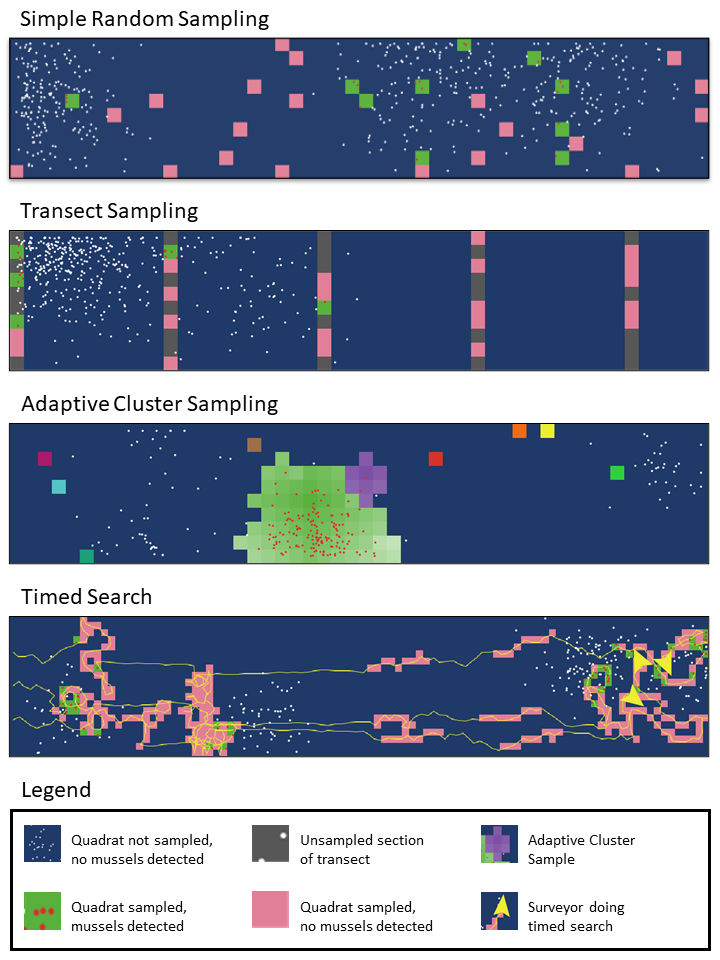

# Summary

Survey Analysis for Monitoring Population Levels (SAMPL) is a spatially-explicit, agent-based model designed to simulate and compare ecological sampling techniques for estimating the density of populations and for optimizing detection rate. SAMPL features four built-in sampling techniques commonly used in field-based ecological sampling; three are quantitative (simple random sampling, transect sampling, and adaptive cluster sampling) and one is qualitative (timed search).  

Sampling intensity can be increased or decreased for each technique and tested with varying spatial distributions, probabilities of detection, and densities of the target organism, all while the true density and distribution of the organism are known. SAMPL will calculate estimated densities for quantitative sampling methods or catch per unit effort (CPUE)--the number of target organisms detected per person-hour of searching--for timed searches. These metrics can then be compared to the true population values to evaluate the performance of the sampling strategy. 

# Statement of need

One of the fundamental goals of ecological field studies is to quantify the true abundance of species in nature. This information is used to generate conservation policy, manage natural resources, evaluate the impact of environmental stressors, and more [@Johnston:2015]. However, in the field, the true population parameters are almost never known due to incomplete sampling (i.e., not every individual is counted), sampling errors, environmental and demographic stochasticity, and so forth, making it difficult to evaluate bias among sampling strategies [@Elphick:2008; @Albert:2010]. SAMPL allows users to test various sampling strategies while the true density and distribution are known, allowing users to evaluate the strategies that maximize accuracy/detection rate, while minimizing sampling effort. SAMPL is designed to assist those who design and implement sampling protocols in the field or those who wish to evaluate the methodological advantages and disadvantages of sampling protocols. 

While there are other software tools designed to simulate spatial sampling strategies, e.g. the ArcGIS Pro sampling toolkit [@Esri:2024], SAMPL is unique because it is open-source, provides a user-friendly graphical user-interface, and simulates specialized sampling methods, like adaptive cluster sampling and timed searches, across different spatial configurations of target organisms.  

# Functionality

SAMPL is implemented in NetLogo [@Wilensky:1999] and was originally designed to simulate surveys for freshwater mussels in riverine habitats. The model refers to target organisms as ‘mussels’, and spatial units are in meters. However, SAMPL can be used to represent a variety of sessile organisms, and spatial units could be scaled up or down accordingly.

The survey techniques featured in SAMPL are based on a field study by [@Sanchez:2021], which compared adaptive cluster sampling, transect sampling, and timed searches for freshwater mussels in Texas rivers. Simple random sampling was added to SAMPL because it is a common sampling method and it is frequently used as the standard against which other methods are compared to (e.g. @Pooler:2005). A description of each sampling method is as follows: 

- Simple random sampling: random quadrats are sampled. A quadrat is a frame used to define a single unit of an area of interest in field sampling. 

- Transect sampling: transects are placed evenly across the area of interest in a parallel orientation, and quadrats are sampled randomly along the transects. 

- Adaptive cluster sampling: quadrats are randomly sampled. If a target organism is detected, the four direct neighboring quadrats are also sampled. This repeats until no more organisms are detected or the sampled 'cluster' reaches the edge of the model grid [@Thompson:1990]. 

- Timed searches: a simulated surveyor 'searches' the area of interest by traveling in a correlated random walk. When the surveyor encounters a target organism, it turns more tightly, thus simulating human search behavior. 

# Acknowledgements

The use of products or trade names does not represent an endorsement of these products by either the authors or the Department of Defense, Department of the Army, or the United States Government. Opinions expressed here are those of the authors and not necessarily those of the agencies they represent. This work was supported by the US Army Corps of Engineers’ Aquatic Nuisance Species Research Program’s focus on Next Generation Ecological Modeling. We would like to thank David Swearingen for his contributions to earlier versions of the model.

# References